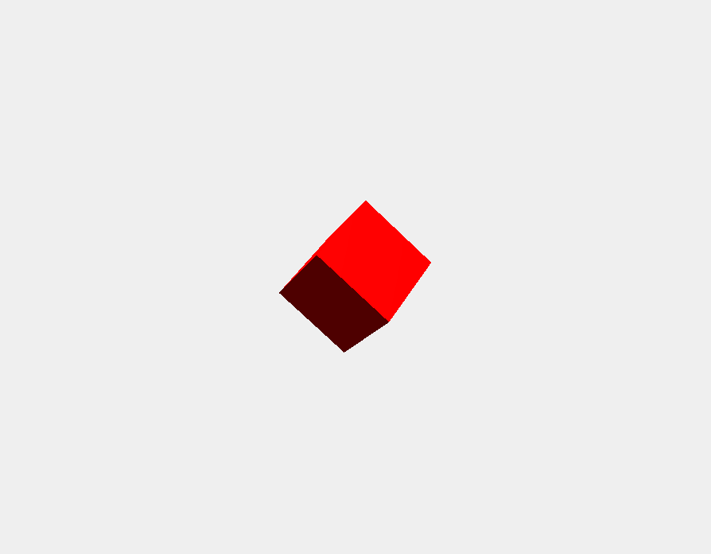

# threejs

## ドットインストールのThree.js入門の５まで試した。（無料の範囲で）
https://dotinstall.com/lessons/basic_threejs_v2

## また公式ドキュメントからライトまわりのコードをコピペして明るくしたもの。
https://threejs.org/docs/index.html#api/en/lights/SpotLight
などを参考にした。

 画面のキャプチャー
